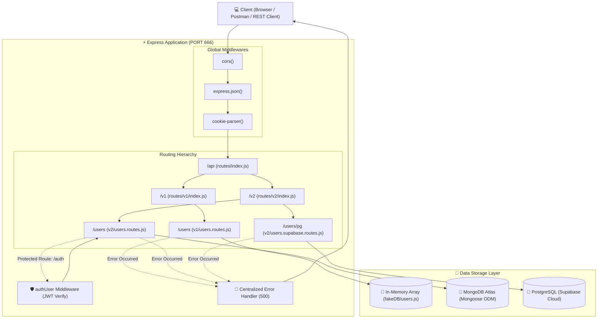
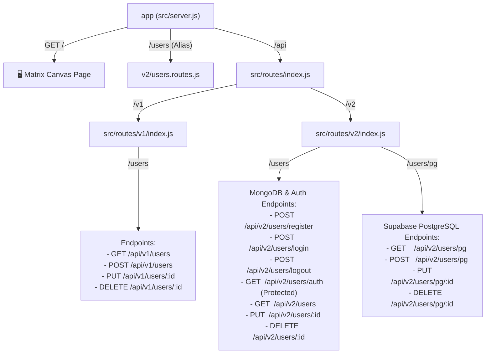
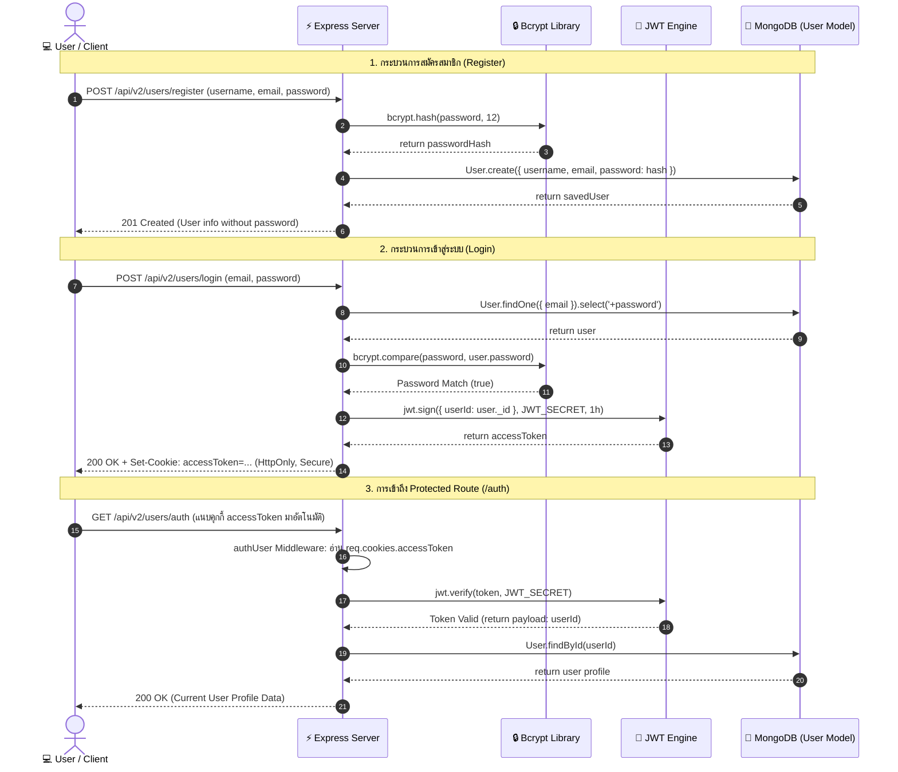
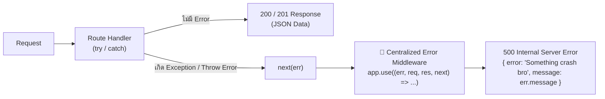

# https://api.siwat.me
# 🌐 JSD-MONO: คู่มือและสถาปัตยกรรมระบบการเรียนรู้ API (API Learning Project)

ยินดีต้อนรับสู่โปรเจคการเรียนรู้และพัฒนาระบบ **Backend RESTful API** แบบ Step-by-Step ตั้งแต่ระดับพื้นฐานจำลองฐานข้อมูลในหน่วยความจำ (In-Memory Database) จนถึงการพัฒนาระบบสถาปัตยกรรมระดับมืออาชีพที่เชื่อมต่อฐานข้อมูลจริงทั้ง **NoSQL (MongoDB)** และ **Relational SQL (PostgreSQL ผ่าน Supabase)** พร้อมระบบความปลอดภัยระดับสูง (**Bcrypt Hashing**, **JWT Authentication** และ **HttpOnly Cookie**)

---

## 📑 สารบัญ (Table of Contents)

1. [ภาพรวมและวิวัฒนาการของโปรเจค (Project Evolution)](#1-ภาพรวมและวิวัฒนาการของโปรเจค-project-evolution)
2. [ความรู้พื้นฐาน: API มีกี่ชนิด และทำหน้าที่อะไรบ้าง?](#2-ความรู้พื้นฐาน-api-มีกี่ชนิด-และทำหน้าที่อะไรบ้าง)
   - [การจำแนกตามสถาปัตยกรรมและโปรโตคอล (Architectural Styles & Protocols)](#21-การจำแนกตามสถาปัตยกรรมและโปรโตคอล-architectural-styles--protocols)
   - [การจำแนกตามขอบเขตการเข้าถึง (Accessibility Scope)](#22-การจำแนกตามขอบเขตการเข้าถึง-accessibility-scope)
   - [HTTP Methods และ CRUD ใน REST API](#23-http-methods-และ-crud-ใน-rest-api)
3. [โครงสร้างไดเรกทอรีของโปรเจค (Project Structure)](#3-โครงสร้างไดเรกทอรีของโปรเจค-project-structure)
4. [เจาะลึกโค้ดแต่ละส่วน: ฟังก์ชันและ API ทำหน้าที่อะไร?](#4-เจาะลึกโค้ดแต่ละส่วน-ฟังก์ชันและ-api-ทำหน้าที่อะไร)
   - [4.1 Server Entry Point (`src/server.js`)](#41-server-entry-point-srcserverjs)
   - [4.2 Configuration Layer (`src/config/`)](#42-configuration-layer-srcconfig)
   - [4.3 API Version 1: In-Memory / Fake DB (`src/routes/v1/`)](#43-api-version-1-in-memory--fake-db-srcroutesv1)
   - [4.4 API Version 2: MongoDB, Bcrypt & JWT Auth (`src/routes/v2/users.routes.js`)](#44-api-version-2-mongodb-bcrypt--jwt-auth-srcroutesv2usersroutesjs)
   - [4.5 API Version 2: Supabase PostgreSQL (`src/routes/v2/users.supabase.routes.js`)](#45-api-version-2-supabase-postgresql-srcroutesv2userssupabaseroutesjs)
   - [4.6 Middleware & Data Model (`authUser.js` & `user.model.js`)](#46-middleware--data-model-authuserjs--usermodeljs)
5. [Workflow การทำงานและการเดินทางของ Request (Request Lifecycle)](#5-workflow-การทำงานและการเดินทางของ-request-request-lifecycle)
6. [แผนภาพประกอบ (Mermaid Diagrams)](#6-แผนภาพประกอบ-mermaid-diagrams)
   - [6.1 ภาพรวมสถาปัตยกรรมและการเดินทางของข้อมูล (System Architecture Flow)](#61-ภาพรวมสถาปัตยกรรมและการเดินทางของข้อมูล-system-architecture-flow)
   - [6.2 ลำดับชั้นโครงสร้าง Routing (Route Hierarchy Tree)](#62-ลำดับชั้นโครงสร้าง-routing-route-hierarchy-tree)
   - [6.3 ลำดับขั้นตอนระบบ Authentication & Protected Route (Sequence Diagram)](#63-ลำดับขั้นตอนระบบ-authentication--protected-route-sequence-diagram)
   - [6.4 ลำดับการประมวลผลข้อผิดพลาด (Centralized Error Pipeline)](#64-ลำดับการประมวลผลข้อผิดพลาด-centralized-error-pipeline)
7. [ตารางสรุป API Endpoints ทั้งหมด (API Reference Table)](#7-ตารางสรุป-api-endpoints-ทั้งหมด-api-reference-table)
8. [วิธีเริ่มต้นใช้งานและการทดสอบ (Getting Started & Testing)](#8-วิธีเริ่มต้นใช้งานและการทดสอบ-getting-started--testing)

---

## 1. ภาพรวมและวิวัฒนาการของโปรเจค (Project Evolution)

โปรเจคนี้ออกแบบมาให้เห็นการเติบโตและการเปลี่ยนผ่านของการเขียนโค้ด Backend อย่างเป็นระบบ แบ่งออกเป็น 4 ระดับ:

```
[ Phase 1: v1 FakeDB ] ───► [ Phase 2: v2 MongoDB ] ───► [ Phase 3: Auth & Security ] ───► [ Phase 4: Supabase PG ]
  - JavaScript Array           - Mongoose ODM                - Bcrypt Hashing (Salt 12)       - PostgreSQL Client
  - In-memory CRUD             - MongoDB Atlas Cloud         - JWT Access Token               - Multi-Database Support
  - เรียนรู้ HTTP Methods       - Schema & Validations        - HttpOnly Cookie Protection     - SQL Cloud Service
```

1. **Phase 1 (API v1 - In-Memory Array)**: เรียนรู้หลักการพื้นฐานของ RESTful API, การรับ-ส่ง JSON ผ่าน Request Body (`req.body`), URL Parameters (`req.params`), และการตอบกลับด้วย HTTP Status Codes ที่เหมาะสม โดยเก็บข้อมูลชั่วคราวใน JavaScript Array (`fakeDB/users.js`)
2. **Phase 2 (API v2 - NoSQL Document Database)**: เปลี่ยนจากการเก็บข้อมูลในหน่วยความจำ มาใช้ **MongoDB** ร่วมกับ **Mongoose ODM** เพื่อให้ข้อมูลคงอยู่ถาวร (Persistence), การทำ Schema Validation และการใช้ฟังก์ชันจัดการข้อมูลระดับฐานข้อมูล
3. **Phase 3 (Authentication & Security)**: ยกระดับความปลอดภัยด้วยการแฮชรหัสผ่านโดยใช้ **Bcrypt (12 Salt Rounds)**, ออกโทเคน **JWT (JSON Web Token)**, จัดเก็บโทเคนลงใน **HttpOnly Cookie** เพื่อป้องกันการโจมตีแบบ XSS (Cross-Site Scripting), พร้อมสร้าง **Middleware (`authUser`)** ป้องกัน Route ที่ต้องการสิทธิ์
4. **Phase 4 (API v2/pg - Relational Database)**: ขยายขีดความสามารถของ Backend ให้รองรับการเชื่อมต่อแบบ Multi-Database โดยนำ **Supabase (PostgreSQL)** เข้ามาจัดการข้อมูลในรูปแบบ Relational Database ควบคู่กับ MongoDB

---

## 2. ความรู้พื้นฐาน: API มีกี่ชนิด และทำหน้าที่อะไรบ้าง?

**API (Application Programming Interface)** คือตัวกลางหรือ "สะพานเชื่อมต่อ" ที่อนุญาตให้ซอฟต์แวร์สองระบบสามารถพูดคุยและแลกเปลี่ยนข้อมูลกันได้ตามกฎเกณฑ์และมาตรฐานที่กำหนดไว้

### 2.1 การจำแนกตามสถาปัตยกรรมและโปรโตคอล (Architectural Styles & Protocols)

| ชนิดของ API                                                         | รูปแบบการทำงาน                                                                             | โปรโตคอล / รูปแบบข้อมูล      | จุดเด่น                                                                           | เหมาะกับงานประเภทใด                                        |
| :------------------------------------------------------------------ | :----------------------------------------------------------------------------------------- | :--------------------------- | :-------------------------------------------------------------------------------- | :--------------------------------------------------------- |
| **REST (Representational State Transfer)** _(โปรเจคนี้ใช้เป็นหลัก)_ | สื่อสารแบบ Stateless ผ่าน HTTP Methods มาตรฐาน อิงทรัพยากร (Resources) ตาม URI             | HTTP/HTTPS (JSON, XML, Text) | ง่าย, เป็นมาตรฐานสากล, มี Cache ในตัว, ยืดหยุ่นสูง                                | เว็บแอปพลิเคชันทั่วไป, Mobile Apps, CRUD APIs              |
| **GraphQL**                                                         | Client เป็นผู้ระบุ Field และโครงสร้างข้อมูลที่ต้องการ ส่งผ่าน Single Endpoint (`/graphql`) | HTTP POST (JSON)             | ลดปัญหา **Over-fetching** (ได้ข้อมูลเกิน) และ **Under-fetching** (ต้องยิงหลายรอบ) | แอปพลิเคชันที่มีข้อมูลซับซ้อน เช่น Dashboard, Social Media |
| **gRPC (Google Remote Procedure Call)**                             | Client สามารถเรียกฟังก์ชันบน Server เสมือนฟังก์ชันในเครื่องตัวเอง โดยใช้ Protocol Buffers  | HTTP/2 (Binary Format)       | ความเร็วสูงมาก, ขนาดข้อมูลเล็ก, รองรับ Streaming สองทาง                           | Microservices ภายในระบบ, ระบบที่ต้องการ Low-latency        |
| **WebSocket**                                                       | สร้างการเชื่อมต่อแบบ Full-Duplex (สองทาง) ค้างไว้ตลอดเวลาผ่าน TCP Connection เดียว         | TCP / WS / WSS               | รับส่งข้อมูลแบบ Real-time ทันทีโดยไม่ต้องคอยยิงถาม (No Polling)                   | Chat Applications, กระดานหุ้น, Multiplayer Games           |
| **SOAP (Simple Object Access Protocol)**                            | โปรโตคอลมาตรฐานเคร่งครัดที่ใช้ XML มีสเปคชัดเจน (WSDL, WS-Security)                        | HTTP, SMTP, TCP (XML)        | มีความปลอดภัยและความน่าเชื่อถือสูงตามข้อกำหนด Enterprise                          | ธุรกรรมการเงิน, ธนาคาร, ระบบองค์กรดั้งเดิม (Legacy)        |
| **Webhook (Reverse API / Event-Driven)**                            | Server ปลายทางเป็นฝ่ายยิง HTTP Request มาบอก Server ของเราเมื่อมี Event เกิดขึ้น           | HTTP POST (JSON)             | ทำงานแบบ Event-driven ไม่ต้องยิง Poll ตรวจสอบสถานะ                                | ระบบตัดเงิน (Stripe, Omise), GitHub Push Notifications     |

---

### 2.2 การจำแนกตามขอบเขตการเข้าถึง (Accessibility Scope)

1. **Public API (Open API)**: เปิดให้บุคคลภายนอกหรือนักพัฒนาทั่วไปเข้าใช้งานได้ เช่น OpenWeather API, Google Maps API
2. **Partner API**: เปิดให้เฉพาะพันธมิตรทางธุรกิจที่มีข้อตกลงและได้รับอนุญาต เช่น API เชื่อมต่อ Payment Gateway
3. **Internal API (Private API)**: ใช้งานเฉพาะภายในองค์กร หรือระหว่าง Frontend กับ Backend ของโปรเจคตนเอง (เช่น โปรเจค `JSD-MONO` นี้)
4. **Composite API**: รวมการเรียก API หลายๆ ตัวเข้าด้วยกันเป็น Request เดียว เพื่อลดภาระ Network Overhead

---

### 2.3 HTTP Methods และ CRUD ใน REST API

REST API สื่อสารความตั้งใจผ่าน **HTTP Request Methods (Verbs)** ให้ตรงกับการทำงานแบบ **CRUD**:

| CRUD Operation | HTTP Method | ความหมาย                              |         Idempotent?          | ตัวอย่างในโปรเจค              |
| :------------- | :---------- | :------------------------------------ | :--------------------------: | :---------------------------- |
| **C**reate     | `POST`      | สร้างทรัพยากรใหม่                     | ไม่ใช่ (ยิงซ้ำได้ข้อมูลใหม่) | `POST /api/v2/users/register` |
| **R**ead       | `GET`       | ดึง/อ่านข้อมูลทรัพยากร                |     ใช่ (ไม่แก้ไขสถานะ)      | `GET /api/v2/users`           |
| **U**pdate     | `PUT`       | แทนที่ข้อมูลทั้งก้อน (Replace/Update) |             ใช่              | `PUT /api/v2/users/:id`       |
| **U**pdate     | `PATCH`     | แก้ไขข้อมูลบางส่วน (Partial Update)   |          ไม่จำเป็น           | แก้ไขเฉพาะ field `role`       |
| **D**elete     | `DELETE`    | ลบทรัพยากรที่ระบุ                     |             ใช่              | `DELETE /api/v2/users/:id`    |

#### HTTP Status Codes สำคัญที่ใช้ในโปรเจค:

- `200 OK`: คำขอสำเร็จ ส่งข้อมูลกลับปกติ
- `201 Created`: สร้างทรัพยากรใหม่สำเร็จ (ใช้ใน `POST /register`, `POST /users`)
- `400 Bad Request`: ข้อมูลที่ส่งมาไม่ถูกต้อง ขาด Field สำคัญ หรือรหัสผ่านไม่ถูก
- `401 Unauthorized`: ไม่ได้รับอนุญาต ไม่มี Token หรือ Token หมดอายุ
- `404 Not Found`: ไม่พบ Resource (User ไม่พบในระบบ)
- `500 Internal Server Error`: เกิดข้อผิดพลาดฝั่งเซิร์ฟเวอร์ (ดักจับผ่าน Centralized Error Handler)

---

## 3. โครงสร้างไดเรกทอรีของโปรเจค (Project Structure)

```
JSD-MONO/
├── README.md                      # เอกสารอธิบายโปรเจคฉบับนี้
├── backend/                       # โค้ดฝั่ง Backend (Node.js + Express)
│   ├── package.json               # รายการ Dependencies และ Scripts ของ Backend
│   ├── users-api-test.rest        # REST Client สำหรับทดสอบ API v1 (FakeDB)
│   ├── users-api-test-v2.rest     # REST Client สำหรับทดสอบ API v2 (MongoDB)
│   ├── users-api-test-v3.rest     # REST Client สำหรับทดสอบ API v2/pg (Supabase)
│   ├── users-api-test-bcrypt.rest # REST Client สำหรับทดสอบ Auth, Bcrypt & Cookie
│   ├── scripts/
│   │   └── test-integration.mjs   # สคริปต์ Automated Test ทดสอบ Regression อัตโนมัติ
│   └── src/
│       ├── server.js              # Entry Point หลักของ Express Server
│       ├── config/                # การตั้งค่าเชื่อมต่อฐานข้อมูลภายนอก
│       │   ├── db.js              # เชื่อมต่อ MongoDB Atlas ด้วย Mongoose
│       │   └── supabase.js        # เชื่อมต่อ Supabase PostgreSQL ด้วย SDK
│       ├── fakeDB/                # ฐานข้อมูลจำลอง (In-Memory Array)
│       │   └── users.js           # ข้อมูล Mock ผู้ใช้สำหรับ v1
│       ├── middlewares/           # มิดเดิลแวร์ตรวจสอบสิทธิ์และดักจับ Request
│       │   └── authUser.js        # ตรวจสอบความถูกต้องของ JWT ใน Cookie
│       ├── models/                # โครงสร้าง Schema และ Data Model ของ Mongoose
│       │   └── user.model.js      # นิยามโครงสร้างตาราง User ใน MongoDB
│       ├── routes/                # ระบบ Routing แบ่งแยกตามเวอร์ชัน
│       │   ├── index.js           # Main API Router รวบรวม /v1 และ /v2
│       │   ├── v1/
│       │   │   ├── index.js       # V1 Main Router
│       │   │   └── users.routes.js# CRUD API บน FakeDB
│       │   └── v2/
│       │       ├── index.js       # V2 Main Router (รวม MongoDB และ Supabase)
│       │       ├── users.routes.js# CRUD, Register, Login, Logout (MongoDB)
│       │       └── users.supabase.routes.js # CRUD บน Supabase PostgreSQL
│       └── utils/
│           └── generateSecretKey.js # ยูทิลิตี้สร้าง Random Secret Key สำหรับ JWT
└── frontend/                      # โค้ดฝั่ง Client (React + Vite)
    ├── package.json
    └── src/
        ├── App.jsx                # UI Component แสดงผล
        └── main.jsx               # React Entry Point
```

---

## 4. เจาะลึกโค้ดแต่ละส่วน: ฟังก์ชันและ API ทำหน้าที่อะไร?

### 4.1 Server Entry Point (`src/server.js`)

เป็นหัวใจหลักของแอปพลิเคชัน ทำหน้าที่บูตระบบ โหลดมิดเดิลแวร์ส่วนกลาง แมปเส้นทาง (Route) และเปิดรับการเชื่อมต่อ

| ฟังก์ชัน / มิดเดิลแวร์                  | ชนิด / รูปแบบ             | หน้าที่การทำงาน                                                                                                                                                 |
| :-------------------------------------- | :------------------------ | :-------------------------------------------------------------------------------------------------------------------------------------------------------------- |
| `express()`                             | Application Factory       | สร้างอินสแตนซ์หลักของ Express Server เพื่อจัดการ Routing และ Middleware                                                                                         |
| `app.use(cors())`                       | Global Middleware         | อนุญาตให้เว็บเบราว์เซอร์จาก Domain/Port อื่น (เช่น Frontend React บนพอร์ต 5173) สามารถยิง Request เข้ามาได้                                                     |
| `app.use(express.json())`               | Global Middleware         | ตัวแปลงข้อมูล (Body Parser) แปลง Request Payload ที่ส่งมาในรูปแบบ JSON ให้อยู่ใน `req.body` อัตโนมัติ                                                           |
| `app.use(cookieParser())`               | Global Middleware         | อ่าน Cookie Header ที่ส่งมาจาก Browser แล้วแปลงให้อยู่ในรูปแบบ Object ใน `req.cookies`                                                                          |
| `app.get("/", ...)`                     | Route Handler             | ให้บริการหน้า Matrix Landing Page สวยงามด้วย Tailwind CSS + Canvas Animation พร้อมปุ่มตรวจสอบสถานะระบบ                                                          |
| `app.use("/api", apiRoutes)`            | Route Mount               | เชื่อมต่อไปยัง Router กลางของ API (`src/routes/index.js`)                                                                                                       |
| `app.use("/users", usersV2Routes)`      | Route Alias               | สร้างเส้นทางเข้ากันได้แบบ Backward-compatible สำหรับ Endpoint ดั้งเดิม (`/users`) ให้ชี้ไปที่ `v2` อัตโนมัติ                                                    |
| `app.use((err, req, res, next) => ...)` | Error Handling Middleware | **Centralized Error Handler**: ดักจับ Error ที่หลุดมาจากทุก Route ผ่าน `next(err)` และตอบกลับ Client ด้วย Status `500` อย่างเป็นมาตรฐาน ไม่ทำให้เซิร์ฟเวอร์แครช |
| `start()`                               | Async Function            | ฟังก์ชันเริ่มต้นระบบ: สั่งเชื่อมต่อ MongoDB (`connectDB`) และ Supabase (`connectSupabase`) ก่อนเปิดเซิร์ฟเวอร์ผ่าน `app.listen(666)`                            |

---

### 4.2 Configuration Layer (`src/config/`)

#### 1. `config/db.js` (MongoDB Connection)

- **`connectDB()`**: เรียกใช้ `mongoose.connect(process.env.MONGODB_URI)` เพื่อสร้าง Connection Pool ไปยังฐานข้อมูล MongoDB Atlas Cloud หากไม่มี URI หรือต่อไม่ติด จะขว้างข้อผิดพลาด (Throw Error) ทันที

#### 2. `config/supabase.js` (Supabase PostgreSQL Connection)

- **`createClient(supabaseUrl, supabaseKey)`**: สร้าง Client instance สำหรับสื่อสารกับ Supabase API ผ่าน Secret Key
- **`connectSupabase()`**: ทดสอบการเชื่อมต่อไปยังตาราง `users` ด้วยคำสั่ง `supabase.from("users").select("id").limit(1)` เพื่อให้แน่ใจว่าฐานข้อมูล Relational พร้อมใช้งาน

---

### 4.3 API Version 1: In-Memory / Fake DB (`src/routes/v1/`)

ใช้งานข้อมูลชั่วคราวจาก `src/fakeDB/users.js` โดยไม่มีฐานข้อมูลจริง เพื่อฝึกฝนการจัดการ Array ด้วย JavaScript Methods พื้นฐาน

| Method & Route             | ฟังก์ชันและโค้ดสำคัญ                             | หน้าที่การทำงาน                                                                                                                            |
| :------------------------- | :----------------------------------------------- | :----------------------------------------------------------------------------------------------------------------------------------------- |
| `GET /api/v1/users`        | `res.json(users)`                                | ส่งข้อมูลผู้ใช้ทั้งหมดที่มีอยู่ใน Array กลับไปเป็น JSON                                                                                    |
| `POST /api/v1/users`       | `users.reduce(...)`, `users.push(newUser)`       | ตรวจสอบว่ามี `username`, `email`, `password` ครบถ้วน คำนวณ Auto-increment ID จากค่าสูงสุดใน Array และเพิ่ม Object ผู้ใช้ใหม่เข้าไปใน Array |
| `PUT /api/v1/users/:id`    | `users.find(u => u.id === req.params.id)`        | ค้นหาผู้ใช้จาก ID ใน URL Params หากพบ จะแก้ไขค่า `username`, `email`, `password` ตามที่ส่งมาใน `req.body`                                  |
| `DELETE /api/v1/users/:id` | `users.findIndex(...)`, `users.splice(index, 1)` | ค้นหาดัชนีของ User ใน Array และใช้ `splice` ลบข้อมูลออกจากหน่วยความจำ                                                                      |

---

### 4.4 API Version 2: MongoDB, Bcrypt & JWT Auth (`src/routes/v2/users.routes.js`)

ระบบจัดการผู้ใช้แบบ Production รวมฐานข้อมูลจริงและการรักษาความปลอดภัยระดับองค์กร

| Method & Route                | ฟังก์ชัน / เทคโนโลยี                                                                   | หน้าที่การทำงานอย่างละเอียด                                                                                                                                                                                                                                                            |
| :---------------------------- | :------------------------------------------------------------------------------------- | :------------------------------------------------------------------------------------------------------------------------------------------------------------------------------------------------------------------------------------------------------------------------------------- |
| `POST /api/v2/users/register` | `bcrypt.hash(password, 12)`, `User.create()`                                           | **สมัครสมาชิก**: รับข้อมูล ตรวจสอบความถูกต้อง นำรหัสผ่านไปแฮชแบบ Asynchronous ด้วย Salt 12 รอบ บันทึกลง MongoDB และส่งข้อมูลกลับโดยลบรหัสผ่านออกจาก Object ที่ Return (`toObject()`)                                                                                                   |
| `POST /api/v2/users/login`    | `User.findOne().select("+password")`, `bcrypt.compare()`, `jwt.sign()`, `res.cookie()` | **เข้าสู่ระบบ**: ค้นหาผู้ใช้ด้วยอีเมล ดึงฟิลด์รหัสผ่านที่ถูกซ่อนไว้ขึ้นมาเปรียบเทียบกับ Plain Text ด้วย `bcrypt.compare` หากถูกต้องจะสร้าง **JWT Token** (มีอายุ 1 ชม.) แล้วนำไปใส่ไว้ใน Cookie ชื่อ `accessToken` ด้วยแฟล็ก `httpOnly: true` (ป้องกัน JavaScript ฝั่ง Client แอบอ่าน) |
| `POST /api/v2/users/logout`   | `res.clearCookie("accessToken")`                                                       | **ออกจากระบบ**: สั่งล้างคุกกี้ `accessToken` ในเบราว์เซอร์ของผู้ใช้                                                                                                                                                                                                                    |
| `GET /api/v2/users/auth`      | Middleware `authUser`, `User.findById(userId)`                                         | **ตรวจสอบผู้ใช้ปัจจุบัน**: ผ่านการตรวจสอบโทเคนจาก `authUser` ก่อน ดึง `req.user.userId` มาค้นหาในฐานข้อมูลและส่งโปรไฟล์กลับไปยืนยันสถานะล็อกอิน                                                                                                                                        |
| `GET /api/v2/users`           | `User.find()`                                                                          | **อ่านรายชื่อผู้ใช้ทั้งหมด**: ดึงข้อมูล Documents ทั้งหมดจาก Collection `users` ใน MongoDB (ไม่แสดงรหัสผ่าน)                                                                                                                                                                           |
| `PUT /api/v2/users/:id`       | `bcrypt.hash()`, `User.findByIdAndUpdate()`                                            | **อัปเดตข้อมูลผู้ใช้**: แก้ไขข้อมูลตาม ID หากมีการส่ง `password` ใหม่มาด้วย ระบบจะนำไปแฮชใหม่ก่อนบันทึกลง Database เสมอ                                                                                                                                                                |
| `DELETE /api/v2/users/:id`    | `mongoose.Types.ObjectId.isValid()`, `findByIdAndDelete()`, `findOneAndDelete()`       | **ลบข้อมูลผู้ใช้**: รองรับการลบแบบอเนกประสงค์ โดยตรวจสอบก่อนว่า ID ที่ส่งมาเป็น ObjectId ของ MongoDB หรือไม่ หากไม่ใช่จะสลับไปค้นหาและลบด้วย `username` ทันที                                                                                                                          |

---

### 4.5 API Version 2: Supabase PostgreSQL (`src/routes/v2/users.supabase.routes.js`)

ระบบ CRUD ที่ทำงานบน Relational Database (PostgreSQL) ผ่าน Supabase Client:

| Method & Route                | เมธอดของ Supabase Client                                      | หน้าที่การทำงาน                                                                          |
| :---------------------------- | :------------------------------------------------------------ | :--------------------------------------------------------------------------------------- |
| `GET /api/v2/users/pg`        | `.from("users").select(...)`                                  | ดึงแถวข้อมูลทั้งหมดจากตาราง SQL พร้อมเลือกเฉพาะคอลัมน์ที่ปลอดภัย                         |
| `POST /api/v2/users/pg`       | `.from("users").insert([...]).select().single()`              | เพิ่ม Record ใหม่ลงในตาราง `users` ของ PostgreSQL พร้อมรับ Record ที่ถูกสร้างกลับมาทันที |
| `PUT /api/v2/users/pg/:id`    | `.from("users").update({...}).eq("id", id).select().single()` | แก้ไขข้อมูลโดยใช้ฟิลเตอร์ SQL WHERE (`.eq("id", id)`) พร้อมบันทึกเวลา `updated_at`       |
| `DELETE /api/v2/users/pg/:id` | `.from("users").delete().eq("id", id)`                        | ลบแถวข้อมูลในตาราง PostgreSQL ตาม Primary Key ID                                         |

---

### 4.6 Middleware & Data Model (`authUser.js` & `user.model.js`)

#### 1. Authentication Middleware (`src/middlewares/authUser.js`)

- **`authUser(req, res, next)`**:
  - อ่านค่าคุกกี้ `req.cookies.accessToken`
  - หากไม่มีคุกกี้ ส่งสถานะ `401 Unauthorized` ("access denied, No token")
  - หากมีคุกกี้ นำไปตรวจสอบด้วย `jwt.verify(token, process.env.JWT_SECRET)`
  - เมื่อถอดรหัสสำเร็จ จะแนบข้อมูล payload ลงใน `req.user` แล้วเรียก `next()` เพื่อส่งต่อไปยัง Handler ถัดไป
  - หากโทเคนไม่ถูกต้องหรือหมดอายุ จะดักจับ Error และส่ง `401 Unauthorized`

#### 2. User Mongoose Model (`src/models/user.model.js`)

- กำหนดพิมพ์เขียว (Schema) ของ MongoDB:
  - `username`: ประเภท String
  - `role`: ประเภท String, มีค่าจำกัดแบบ Enum เฉพาะ `["user", "admin"]` (ค่าเริ่มต้นคือ `user`)
  - `email`: บังคับ Unique, ตัวพิมพ์เล็กทั้งหมด, ตัดช่องว่าง (`trim`), และตรวจสอบรูปแบบด้วย Regex Format (`/^[^\s@]+@[^\s@]+\.[^\s@]+$/`)
  - `password` & `passwordHash`: กำหนด `select: false` เพื่อให้ Mongoose ตัดฟิลด์นี้ออกจากการ Query ปกติโดยอัตโนมัติ เพื่อป้องกันรหัสผ่านรั่วไหล
  - `timestamps: true`: สร้างฟิลด์ `createdAt` และ `updatedAt` อัตโนมัติ

---

## 5. Workflow การทำงานและการเดินทางของ Request (Request Lifecycle)

เมื่อ Client (เบราว์เซอร์, โมบายแอป, หรือ REST Client) ส่งคำขอเข้ามายังเซิร์ฟเวอร์ ข้อมูลจะเดินทางผ่านเลเยอร์ต่างๆ ตามลำดับดังนี้:

```
[ Client Request ]
       │
       ▼
1. Global Middlewares Layer
   ├── CORS Middleware         ──► ตรวจสอบสิทธิ์ Origin
   ├── Express JSON Parser     ──► แปลง Payload ใน Body เป็น Object
   └── Cookie Parser           ──► แปลง Header Cookie เป็น req.cookies
       │
       ▼
2. Root & Sub-Router Matching (Cascade Routing)
   ├── "/"                     ──► Matrix Landing Page
   ├── "/users" (Alias)        ──► v2 User Routes (Backward Compatibility)
   └── "/api"                  ──► Main API Router (routes/index.js)
           ├── "/v1"           ──► v1 Router (routes/v1/index.js)
           │     └── "/users"  ──► v1 Users CRUD (In-Memory FakeDB)
           └── "/v2"           ──► v2 Router (routes/v2/index.js)
                 ├── "/users"  ──► MongoDB Controller (Auth, Bcrypt, CRUD)
                 └── "/users/pg" ──► Supabase PostgreSQL Controller
       │
       ▼
3. Route-Level Middleware (Optional)
   └── authUser Middleware     ──► สกัด JWT จาก Cookie ──► ตรวจสอบ Signature
       │
       ▼
4. Controller / Business Logic
   ├── FakeDB Array Manipulation
   ├── Mongoose ODM Query (User.find, User.create, ...)
   └── Supabase Client Query (supabase.from(...))
       │
       ▼
5. Response / Error Dispatching
   ├── ทำงานสำเร็จ               ──► res.status(2xx).json(...)
   └── เกิดข้อผิดพลาด            ──► next(err) ──► Centralized Error Middleware (Status 500)
```

---

## 6. แผนภาพประกอบ (Mermaid Diagrams)

### 6.1 ภาพรวมสถาปัตยกรรมและการเดินทางของข้อมูล (System Architecture Flow)



---

### 6.2 ลำดับชั้นโครงสร้าง Routing (Route Hierarchy Tree)



---

### 6.3 ลำดับขั้นตอนระบบ Authentication & Protected Route (Sequence Diagram)



---

### 6.4 ลำดับการประมวลผลข้อผิดพลาด (Centralized Error Pipeline)



---

## 7. ตารางสรุป API Endpoints ทั้งหมด (API Reference Table)

| เวอร์ชัน          | HTTP Method | Endpoint Path            | ต้อง Login? | Request Body (ตัวอย่าง)                     | คำอธิบายการทำงาน                                    |
| :---------------- | :---------- | :----------------------- | :---------: | :------------------------------------------ | :-------------------------------------------------- |
| **System**        | `GET`       | `/`                      |     ❌      | ไม่มี                                       | หน้า Matrix Dashboard แสดงสถานะเซิร์ฟเวอร์          |
| **v1 (FakeDB)**   | `GET`       | `/api/v1/users`          |     ❌      | ไม่มี                                       | ดึงข้อมูลผู้ใช้ทั้งหมดจาก In-Memory Array           |
| **v1 (FakeDB)**   | `POST`      | `/api/v1/users`          |     ❌      | `{"username", "email", "password"}`         | สร้าง User ใหม่ลงใน In-Memory Array                 |
| **v1 (FakeDB)**   | `PUT`       | `/api/v1/users/:id`      |     ❌      | `{"username", "email", "password"}`         | อัปเดตข้อมูลผู้ใช้ใน Array ตาม ID                   |
| **v1 (FakeDB)**   | `DELETE`    | `/api/v1/users/:id`      |     ❌      | ไม่มี                                       | ลบผู้ใช้ใน Array ตาม ID                             |
| **v2 (Auth)**     | `POST`      | `/api/v2/users/register` |     ❌      | `{"username", "email", "password", "role"}` | สมัครสมาชิก แฮชรหัสผ่านด้วย Bcrypt ลง MongoDB       |
| **v2 (Auth)**     | `POST`      | `/api/v2/users/login`    |     ❌      | `{"email", "password"}`                     | ตรวจสอบรหัสผ่าน ออก JWT เก็บใน HttpOnly Cookie      |
| **v2 (Auth)**     | `POST`      | `/api/v2/users/logout`   |     ❌      | ไม่มี                                       | ล้างคุกกี้ `accessToken` เพื่อออกจากระบบ            |
| **v2 (Auth)**     | `GET`       | `/api/v2/users/auth`     | ✅ (Cookie) | ไม่มี                                       | ตรวจสอบ JWT Token และส่งโปรไฟล์ผู้ใช้ปัจจุบัน       |
| **v2 (MongoDB)**  | `GET`       | `/api/v2/users`          |     ❌      | ไม่มี                                       | อ่านรายชื่อ User ทั้งหมดจาก MongoDB                 |
| **v2 (MongoDB)**  | `PUT`       | `/api/v2/users/:id`      |     ❌      | `{"username", "email", "password"}`         | อัปเดตข้อมูล User ใน MongoDB (แฮชรหัสผ่านใหม่)      |
| **v2 (MongoDB)**  | `DELETE`    | `/api/v2/users/:id`      |     ❌      | ไม่มี                                       | ลบ User จาก MongoDB (รองรับ ObjectId หรือ Username) |
| **v2 (Supabase)** | `GET`       | `/api/v2/users/pg`       |     ❌      | ไม่มี                                       | ดึงรายชื่อผู้ใช้จาก Supabase PostgreSQL             |
| **v2 (Supabase)** | `POST`      | `/api/v2/users/pg`       |     ❌      | `{"username", "email", "password", "role"}` | เพิ่มแถวข้อมูลใหม่ลงในตาราง SQL ของ Supabase        |
| **v2 (Supabase)** | `PUT`       | `/api/v2/users/pg/:id`   |     ❌      | `{"username", "email", "password", "role"}` | แก้ไขข้อมูลในตาราง SQL ของ Supabase ตาม UUID        |
| **v2 (Supabase)** | `DELETE`    | `/api/v2/users/pg/:id`   |     ❌      | ไม่มี                                       | ลบแถวข้อมูลในตาราง SQL ของ Supabase ตาม UUID        |

---

## 8. วิธีเริ่มต้นใช้งานและการทดสอบ (Getting Started & Testing)

### 8.1 การติดตั้งและตั้งค่า Environment Variables

1. ไปที่โฟลเดอร์ `backend`:

   ```bash
   cd backend
   npm install
   ```

2. สร้างไฟล์ `.env` ที่โฟลเดอร์ `backend/` และระบุค่าตัวแปร:

   ```env
   PORT=666
   MONGODB_URI=mongodb+srv://<username>:<password>@cluster0.mongodb.net/myDatabase
   SUPABASE_URL=https://<project-id>.supabase.co
   SUPABASE_SECRET_KEY=eyJhbGciOiJIUzI1NiIsInR5cCI6IkpXVCJ9...
   JWT_SECRET=your_super_secret_jwt_key_here
   NODE_ENV=development
   ```

   _(หมายเหตุ: สามารถรัน `node src/utils/generateSecretKey.js` เพื่อสุ่มสร้าง `JWT_SECRET` ที่ปลอดภัยได้)_

3. รันเซิร์ฟเวอร์ในโหมด Development (มี Watch Mode):
   ```bash
   npm run dev
   ```
   เซิร์ฟเวอร์จะเปิดทำงานที่ `http://localhost:666`

---

### 8.2 การทดสอบ API (Testing)

คุณสามารถทดสอบ Endpoint ต่างๆ ได้ 2 วิธี:

#### วิธีที่ 1: ใช้ไฟล์ REST Client Extension (`.rest`)

เปิดไฟล์ `.rest` ผ่าน Visual Studio Code (ที่ติดตั้ง Extension _REST Client_):

- `backend/users-api-test.rest`: ทดสอบ API v1 (FakeDB)
- `backend/users-api-test-v2.rest`: ทดสอบ API v2 (MongoDB CRUD)
- `backend/users-api-test-v3.rest`: ทดสอบ API v2/pg (Supabase PostgreSQL CRUD)
- `backend/users-api-test-bcrypt.rest`: ทดสอบ Auth Flow, Register, Login, Logout, Cookie

#### วิธีที่ 2: รันสคริปต์ Automated Integration Test

รันสคริปต์ทดสอบอัตโนมัติที่ครอบคลุมทุก Endpoint และ Regression Flow:

```bash
node backend/scripts/test-integration.mjs
```

สคริปต์จะทำการทดสอบ Root Endpoint, v1 FakeDB, v2 MongoDB, v2 Supabase, Authentication Flow (Register ➔ Login ➔ Cookie Verification ➔ Protected Route ➔ Logout) และแสดงผลลัพธ์ Pass/Fail อย่างชัดเจน
